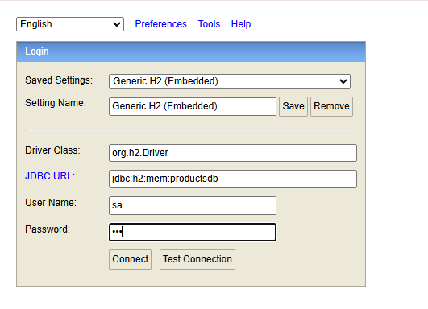

# 🧪 Prueba Técnica – Sistema de Productos con Precios Históricos
### *Hecha por: María Inmaculada Domínguez Vargas*

## ⚙️ Instrucciones del proyecto

Si queremos **COMPILAR** el proyecto, debemos ejecutar el siguiente comando si tenemos Gradle instalado:

```bash 
   gradle build 
```
o si no lo tenemos, podemos usar el wrapper de Gradle incluido en el proyecto desde Git Bash:

```bash 
   ./gradlew clean build 
```
Para **EJECUTAR** el proyecto, podemos usar el siguiente comando:

```bash 
   gradle bootRun 
```
o con el wrapper:
```bash 
   ./gradlew bootRun 
```
o ir a la clase `com.mango.products.ProductsApplication` y ejecutarla como una aplicación Java.

Para ver la base de datos H2, podemos acceder a través del navegador a `http://localhost:8080/h2-console` y usar las siguientes credenciales:
- Driver Class: `org.h2.Driver`
- JDBC URL: `jdbc:h2:mem:productsdb`
- User Name: `sa`
- Password: `pss`



---

## 📘 Decisiones técnicas

- **Framework**: He elegido Spring Boot por su robustez, facilidad de uso y amplia comunidad. Durante mi formación y durante estos años de trabajo siempre he optado por Spring, ya que permite configurar y desarrollar rápidamente APIs RESTful.
- **Arquitectura**: He seguido una Arquitectura Hexagonal/Clean Architecture para mantener una separación clara de responsabilidades y facilitar el mantenimiento y escalabilidad del código a futuro. He nombrado las clases de acuerdo al flujo al que corresponden para que sea fácilmente detectable qué hace cada una.
- **Base de datos**: He optado por H2 en memoria para facilitar la ejecución y su soporte web para garantizar la visibilidad de los datos a la hora de hacer pruebas.
- **Validaciones**: He implementado validaciones tanto a nivel de entidad como a nivel de servicio para asegurar la integridad de los datos y el cumplimiento de las reglas de negocio.
- **Tests**: He incluido pruebas unitarias para los servicios y pruebas de integración para los endpoints, utilizando JUnit y Mockito para asegurar la calidad del código y la correcta funcionalidad de la API.

## 🌐 Endpoints

1. **Crear un producto**
    - `POST /products`
    - Body:
      ```json
      {
        "id": 1,
        "name": "Zapatillas deportivas",
        "description": "Modelo 2025 edición limitada"
      }
      ```
      Aquí he añadido el campo `id` en el body para facilitar al usuario la posterio búsqueda, modificación de precio o eliminación del producto que ha creado.


2. **Agregar un precio a un producto**
    - `POST /products/{id}/prices`
    - Body:
      ```json
      {
         "productName": "Running Sneakers",
         "price": 100.45,
         "initDate": "2027-04-15",
         "endDate": "2027-04-17"
      }
      ```
    En este endpoint, he añadido en la respuesta el nombre de producto al que le vamos a agregar el precio, para que el usuario pueda verificar que está agregando el precio al producto correcto.
    Para validar las fechas, más concretamente el caso de que no haya colisión entre las fechas de los precios ya vigentes en el productos y el nuevo precio, me gustaría haber hecho una consulta 
    en el repositorio para mejorar la eficiencia y rendimiento de esa parte de la aplicación. Sin embargo, no he llegado a ninguna consulta que pudiera ser fácil de leer y que funcionase a la vez.


3. **Obtener el precio vigente de un producto en una fecha**
    - `GET /products/{id}/prices?date=2024-04-15`
    - Body:
      ```json
      {
        "value": 99.99
      }
      ```

    Este response lo he dejado tal y como está, pues el usuario ya debe ser por la variable 'id' en el path qué producto está consultando.


4. **Obtener el historial completo de precios de un producto**
    - `GET /products/{id}/prices/record`
    - Body:
      ```json
      {
        "name": "Zapatillas deportivas",
        "description": "Modelo 2025 edición limitada",
        "prices": [
          {
            "value": 99.99,
            "initDate": "2024-01-01",
            "endDate": "2024-06-30"
          },
          {
            "value": 199.99,
            "initDate": "2025-01-01",
            "endDate": "2025-06-30"
          }
        ]
      }
      ```
    En este caso he cambiado el path ("/products/{id}/prices/record") para que no haya conflicto con el endpoint anterior, pues aunque tengan distintos parámetros, Spring no distingue las rutas para este tipo de casos.

## Nota 

El zip del proyecto incluye una colección de Postman llamada **"PRODUCTS CHALLENGE.postman_collection"** con ejemplos de peticiones para cada endpoint. Solo hay que importar la colección en Postman y ejecutar las peticiones con la aplicación en marcha.

---


